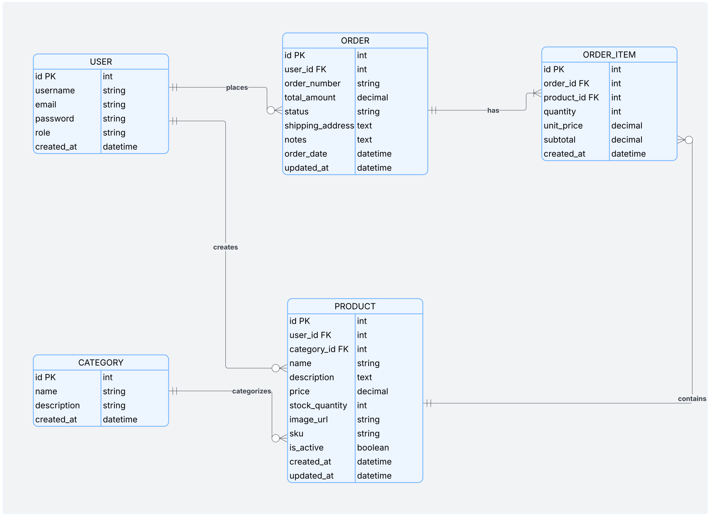

# Inventory Management System - Django REST API

## 📝 Project Description
A robust REST API for an inventory and order management system built with Django REST Framework. This backend provides comprehensive endpoints for product management, order processing, user authentication, and administrative functions.

## 🚀 Tech Stack
- **Python** 3.11
- **Django** 4.2.7
- **Django REST Framework** 3.14.0
- **PostgreSQL** 15
- **Simple JWT** for authentication
- **Django CORS Headers**
- **Django Filters**
- **Stripe** for payment processing
- **Docker**

## 🔗 Links
- **Frontend Repository**: [https://github.com/YuTaX9/Order-and-Inventory-Management-System-frontend]
- **Deployed Site**: [Deploy ]

## 📊 ERD Diagram


**Models:**
1. **User** (Django built-in)
2. **Category**: Product categories
3. **Product**: Products with inventory tracking
4. **Order**: Customer orders
5. **OrderItem**: Individual items in orders
6. **Payment**: Payment records (Stripe integration)

**Relationships:**
- User → Products (One-to-Many)
- User → Orders (One-to-Many)
- Category → Products (One-to-Many)
- Order → OrderItems (One-to-Many)
- Product → OrderItems (One-to-Many)
- Order → Payment (One-to-One)

## 🛣️ API Endpoints

### Authentication
| Method | Endpoint | Description | Auth Required |
|--------|----------|-------------|---------------|
| POST | `/api/auth/register/` | Register new user | No |
| POST | `/api/auth/login/` | Login and get JWT tokens | No |
| POST | `/api/auth/token/refresh/` | Refresh access token | No |
| GET | `/api/auth/profile/` | Get user profile | Yes |
| PUT | `/api/auth/profile/` | Update user profile | Yes |

### Categories
| Method | Endpoint | Description | Auth Required |
|--------|----------|-------------|---------------|
| GET | `/api/categories/` | List all categories | No |
| POST | `/api/categories/` | Create category | Admin |
| GET | `/api/categories/{id}/` | Get single category | No |
| PUT | `/api/categories/{id}/` | Update category | Admin |
| DELETE | `/api/categories/{id}/` | Delete category | Admin |
| GET | `/api/categories/{id}/products/` | Get products in category | No |

### Products
| Method | Endpoint | Description | Auth Required |
|--------|----------|-------------|---------------|
| GET | `/api/products/` | List all products | No |
| POST | `/api/products/` | Create product | Yes |
| GET | `/api/products/{id}/` | Get single product | No |
| PUT | `/api/products/{id}/` | Update product | Owner/Admin |
| DELETE | `/api/products/{id}/` | Delete product | Owner/Admin |
| PATCH | `/api/products/{id}/update_stock/` | Update stock quantity | Owner/Admin |
| GET | `/api/products/low_stock/` | Get low stock products | Admin |

**Query Parameters for Products:**
- `search`: Search by name, description, SKU
- `category`: Filter by category ID
- `min_price`: Minimum price filter
- `max_price`: Maximum price filter
- `in_stock`: Show only in-stock items (true/false)
- `ordering`: Sort by (price, -price, created_at, -created_at, name, -name)

### Orders
| Method | Endpoint | Description | Auth Required |
|--------|----------|-------------|---------------|
| GET | `/api/orders/` | List orders (user's or all if admin) | Yes |
| POST | `/api/orders/` | Create new order | Yes |
| GET | `/api/orders/{id}/` | Get order details | Yes (Owner/Admin) |
| GET | `/api/orders/my_orders/` | Get current user's orders | Yes |
| POST | `/api/orders/{id}/cancel/` | Cancel order | Yes (Owner/Admin) |
| PATCH | `/api/orders/{id}/update_status/` | Update order status | Admin |

**Order Status Options:**
- `pending`: Order placed, not yet processed
- `processing`: Order is being prepared
- `shipped`: Order has been shipped
- `delivered`: Order delivered to customer
- `cancelled`: Order cancelled

### Payments (Stripe Integration)
| Method | Endpoint | Description | Auth Required |
|--------|----------|-------------|---------------|
| POST | `/api/payments/create-payment-intent/` | Create Stripe payment intent | Yes |
| POST | `/api/payments/confirm/` | Confirm payment | Yes |
| GET | `/api/payments/{order_id}/` | Get payment details | Yes (Owner/Admin) |
| POST | `/api/payments/webhook/` | Stripe webhook endpoint | No (Stripe) |

### Shipping
| Method | Endpoint | Description | Auth Required |
|--------|----------|-------------|---------------|
| POST | `/api/shipping/calculate/` | Calculate shipping cost | No |
| GET | `/api/shipping/rates/` | Get available shipping rates | No |

### Admin
| Method | Endpoint | Description | Auth Required |
|--------|----------|-------------|---------------|
| GET | `/api/admin/stats/` | Get dashboard statistics | Admin |

## 💾 Database Schema

### Category Model
```python
- id: Integer (PK)
- name: String (unique)
- description: Text
- created_at: DateTime
- updated_at: DateTime
```

### Product Model
```python
- id: Integer (PK)
- user: ForeignKey(User)
- category: ForeignKey(Category)
- name: String
- description: Text
- price: Decimal
- stock_quantity: Integer
- sku: String (unique)
- image_url: URL
- is_active: Boolean
- created_at: DateTime
- updated_at: DateTime
```

### Order Model
```python
- id: Integer (PK)
- user: ForeignKey(User)
- order_number: String (unique, auto-generated)
- total_amount: Decimal
- status: Choice (pending, processing, shipped, delivered, cancelled)
- shipping_address: Text
- notes: Text
- order_date: DateTime
- updated_at: DateTime
```

### OrderItem Model
```python
- id: Integer (PK)
- order: ForeignKey(Order)
- product: ForeignKey(Product)
- quantity: Integer
- unit_price: Decimal
- subtotal: Decimal (calculated)
- created_at: DateTime
```

## 🔧 Installation Instructions

### Prerequisites
- Python 3.11+
- PostgreSQL 15+
- Docker

### Local Setup (Without Docker)

1. **Clone the repository**
```bash
git clone <backend-repo-url>
cd inventory-backend
```

2. **Create virtual environment**
```bash
python -m venv venv
source venv/bin/activate # On Windows: venv\Scripts\activate
```

3. **Install dependencies**
```bash
pip install -r requirements.txt
```

4. **Configure environment variables**
Create `.env` file in project root:
```env
DEBUG=True
SECRET_KEY=secret-key-here
DATABASE_NAME=order_inventory_db
DATABASE_USER=postgres
DATABASE_PASSWORD=postgres
DATABASE_HOST=localhost
DATABASE_PORT=5432
ALLOWED_HOSTS=localhost,127.0.0.1
```

5. **Create PostgreSQL database**
```bash
psql -U postgres
CREATE DATABASE order_inventory_db;
\q
```

6. **Run migrations**
```bash
python manage.py makemigrations
python manage.py migrate
```

7. **Create superuser**
```bash
python manage.py createsuperuser
```

8. **Run development server**
```bash
python manage.py runserver
```

API will be available at: `http://localhost:8000/api/`

### Docker Setup


4. **Access the API:**
- Backend: `http://localhost:8000/api/`
- Admin Panel: `http://localhost:8000/admin/`

### Running Tests
```bash
python manage.py test
```

## 🎯 Key Features

- ✅ JWT Authentication with refresh tokens
- ✅ Role-based permissions (User, Admin)
- ✅ User registration and profile management
- ✅ Password reset via email
- ✅ Full CRUD operations on all models
- ✅ Advanced filtering and search
- ✅ Automatic stock management
- ✅ Order processing with stock validation
- ✅ Admin dashboard statistics
- ✅ Low stock alerts
- ✅ CORS enabled for frontend
- ✅ Stripe Payment Integration: Secure payment processing
- ✅ Email Notifications: Password reset and order confirmations (Not in Deployment)
- ✅ Shipping Cost Calculation: Dynamic shipping based on order total


## 📦 IceBox Features (Future Enhancements)

- [ ] Product reviews and ratings
- [ ] Wishlist functionality
- [ ] Export orders/inventory to CSV/Excel
- [ ] Advanced analytics and reporting
- [ ] Multi-image upload for products
- [ ] Discount codes and promotions
- [ ] Real-time stock updates with WebSockets
- [ ] Product variants (size, color)

## 👨‍💻 Contributors
- Bassam Alghamdi - Full Stack Developer

## 📄 License
This project is for educational purposes.